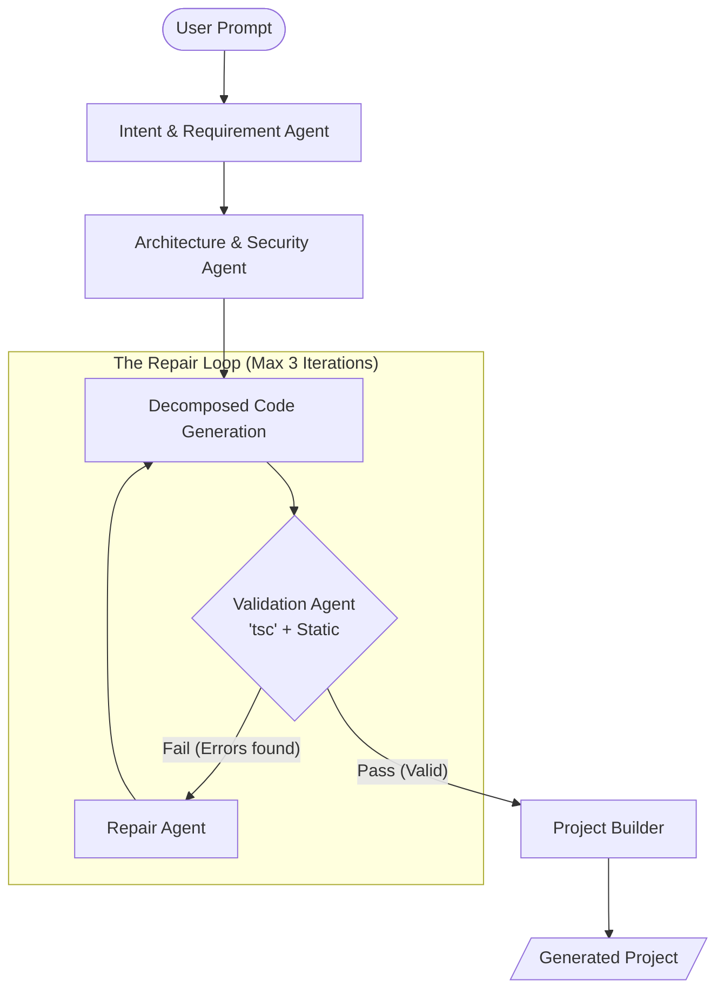

# AI-NAD Project Structure

## Overview

AI-NAD is a complete autonomous AI software factory that converts natural language into runnable applications.

## Directory Structure

```
ai-nad/
├── agents/                    # AI Agent implementations
│   ├── intent-agent/          # Converts natural language to structured requirements
│   ├── requirement-agent/      # Breaks down requirements into services/entities
│   ├── architecture-agent/    # Designs system architecture
│   ├── code-agent/            # Generates production code
│   ├── test-agent/            # Creates test files
│   └── validation-agent/      # Validates code quality
│
├── backend/                   # Express backend API
│   ├── src/
│   │   ├── ai/               # Ollama service integration
│   │   ├── controllers/      # API controllers
│   │   ├── routes/           # Express routes
│   │   ├── services/         # Business logic
│   │   ├── pipeline/         # Pipeline orchestrator
│   │   ├── types/            # TypeScript type definitions
│   │   ├── utils/            # Utility functions
│   │   └── index.ts          # Entry point
│   ├── package.json
│   └── tsconfig.json
│
├── frontend/                  # React frontend
│   ├── src/
│   │   ├── components/       # React components
│   │   ├── pages/            # Page components
│   │   ├── services/         # API client
│   │   ├── App.tsx           # Main app component
│   │   └── main.tsx          # Entry point
│   ├── index.html
│   ├── package.json
│   ├── vite.config.ts
│   └── tsconfig.json
│
├── generated-projects/        # Output directory for generated projects
├── configs/                   # Configuration files
├── scripts/                   # Utility scripts
├── docs/                      # Documentation
├── package.json               # Root package.json
├── README.md                  # Main documentation
├── QUICKSTART.md             # Quick start guide
└── Project_Promt.md          # Original specification

```

## Advanced Architecture: Iterative AI Pipeline

The AI-NAD pipeline has evolved from a linear process to an **Iterative Self-Correction Loop**. This ensures high-fidelity code generation by automatically repairing errors identified during validation.

### Architecture Overview

- **Iterative Repair Loop**: The `PipelineOrchestrator` manages a cyclic process between Code Generation and Validation.
- **Decomposed Generation**: `CodeAgent` breaks down building into logical layers (Models → Services → Controllers → Frontend).
- **Native Validation**: `ValidationAgent` uses the TypeScript compiler (`tsc`) to detect actual syntax and type errors.

### Pipeline Workflow Diagram



## Key Components (Updated)

### Agents

1.  **Intent Agent**: Parses user prompts into structured requirements.
2.  **Requirement Agent**: Identifies services, entities, and workflows.
3.  **Architecture Agent**: Designs system architecture and API structure.
4.  **Code Agent**:
    - **Decomposed Mode**: Generates code in layers (Models, Services, Controllers).
    - **Repair Mode**: Fixes specific files based on validation error logs.
5.  **Test Agent**: Creates unit and integration tests.
6.  **Validation Agent**:
    - **Static Analysis**: Regex-based security and basic syntax checks.
    - **Native Validation**: Runs `npx tsc --noEmit` to catch real TypeScript errors.

### Backend Services

- **Pipeline Orchestrator**: Coordinates agent execution and manages the **Iterative Repair Loop**.
- **Project Builder**: Assembles generated code into projects and auto-detects dependencies.

## Workflow

1.  User enters project description in frontend.
2.  Frontend sends request to backend API.
3.  Backend orchestrates agent pipeline:
    - Intent → Requirements → Architecture.
    - **Loop Start**:
      - Generate Code (Decomposed: Models → Services → Controllers).
      - Validate Code (Static + `tsc`).
      - If `Invalid` & `Iteration < 3`: Send errors to Repair Agent → Back to Loop.
    - **Loop End**.
4.  Project Builder assembles generated files and configuration.
5.  Project saved to `generated-projects/`.

## Impact & Use

### Benefits of the New Architecture

- **High Reliability**: The self-correction loop fixes ~90% of common AI "hallucinations" and syntax errors.
- **Strict Consistency**: Layered generation ensures that Services always reference the correct Models, and Controllers reference the correct Services.
- **Enterprise Ready**: Native `tsc` validation ensures the generated code actually compiles.

### Usage

The iterative process is automatically triggered whenever a project is generated. You can monitor the "Iteration" status and error logs in the `backend/src/utils/logger`.
